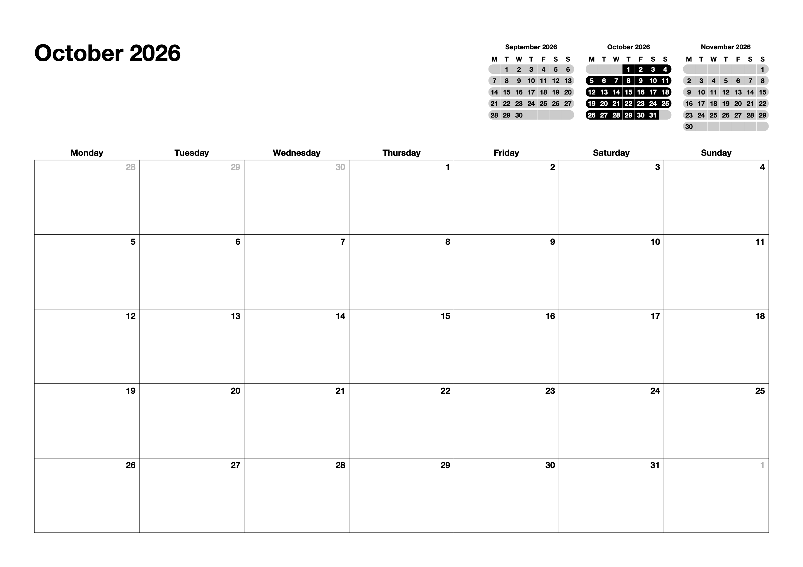

# Gencal – Generate Monthly Calendars

A printable monthly calendar built with Typst, with a large writing grid and small calendars for the previous, current, and next months. Weekdays, month lengths, leap years, and row counts are calculated automatically.



## Compile a calendar

Typst is required to compile the PDF. Run this command from the project folder, replacing the month, year, and output filename:

```bash
typst compile --input month=MONTH --input year=YEAR calendar.typ OUTPUT.pdf
```

For example, to generate October 2026:

```bash
typst compile --input month=October --input year=2026 calendar.typ october-2026.pdf
```

Use a full English month name. The resulting PDF is saved to the specified output path.
